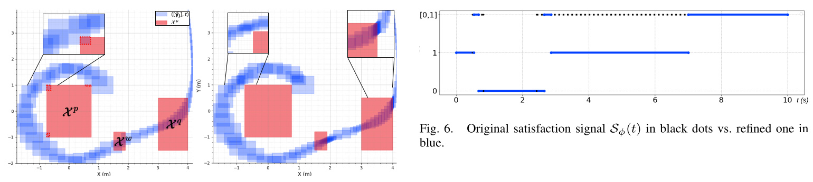

Welcome ! This is a prototype for the verification of STL formula on reachable tube using Dynibex. It has been tested on Linux Ubuntu only.
It uses DynIbex.

Install Dynibex:
https://perso.ensta-paris.fr/~chapoutot/dynibex/index.php#download-installation

In recent Ubuntu versions you might need to do the the install in a python 2.7 virtual environement and :
sudo CXXFLAGS="-std=c++14" ./waf configure
sudo CXXFLAGS="-std=c++14" ./waf install

If dynibex is a local install add to the make file:
export PKG_CONFIG_PATH='path_to_dynibex'/share/pkgconfig 

Make the code:
Open terminal in the CSTL directory and compile using make:
make

Run:
./simulation.out

If everything works correctly, the output should be for the last two line:
-------satisfaction à 0s :1
----------new_iteration-----------1
----------Current_simulation_time-----------6


"example_stl_vanderpol.m" is the implementation using CORA and Lercher's "Using Four-Valued Signal Temporal Logic for Incremental Verification of Hybrid Systems" verification protocol.

## STL Formula Verification

Verification is performed bottom-up using the syntax tree of the formula and satisfaction signals.

Supported operators:

```
phi1 = neg_stl(phi);                        // Logical negation: ¬phi
phi1 = and_stl(phi2, phi3);                 // Logical AND: phi2 ∧ phi3
phi1 = or_stl(phi2, phi3);                  // Logical OR: phi2 ∨ phi3
phi1 = until_stl(phi2, phi3, {t1, t2});     // Until operator: phi2 U[t1,t2] phi3
phi1 = Finally(phi, {t1, t2});              // Eventually operator: F[t1,t2] phi
phi1 = Globally(phi, {t1, t2});             // Always operator: G[t1,t2] phi
```

Predicate satisfaction:

```
predicate_satisfaction(sim, predicates);
```

This constructs satisfaction signals for a list of predicates and the simulation object.
The output is a list of signals corresponding to each predicate.

Display signals:

```
print_Satisf_Signals(phi);
```

This displays the satisfaction signal of a given formula.

****************
Image: Experiment with a non linear oscillator and uncertainty tracking to mitigate over-approximation.
<p align="center">
  
</p>

****************
## Goal

Track where STL satisfaction becomes uncertain and refine only what matters (specific reachable sets or missing simulation), instead of recomputing everything.&#x20;

## Building Blocks

1. Boolean interval semantics for truth values:
   0 = false, 1 = true, \[0,1] = undetermined. Logical ops (∧, ∨, ¬) lift pointwise to intervals.&#x20;

2. Satisfaction signals (time → {0,1} extended to interval form):
   Decompose any STL subformula into unitary signals (true on one continuous interval) so temporal ops can be built from unions/intersections of these pieces.&#x20;

3. Markers:
   Each uncertain unit (a unitary signal with \[0,1]) carries a set of indices pointing to the reachable sets that caused it. These markers are propagated up the satisfaction tree.&#x20;

## What Is Tracked

* For each predicate µ over the tube [ỹ](t), label each time slice \[tj, tj+1] as:
  1 if [ỹ](t) ⊂ Xµ, 0 if [ỹ](t) ∩ Xµ = ∅, \[0,1] otherwise.
  Merge consecutive slices of the same kind into unitary intervals; attach marker M = {all j that contributed \[0,1] there}.&#x20;

## How Tracking Works (Bottom-Up Through the Formula)

At predicates:

* Start markers at the leaves from the uncertain predicate intervals as above.&#x20;

Boolean operators:

* OR: [Sϕ1 ∨ Sϕ2](I)
  If one side is 1 on I, result is 1 and you DROP the other side’s markers on that I.
  If both sides contribute \[0,1] on overlapping I, result is \[0,1] with union of markers.
  If one side is 0, copy markers from the other.&#x20;
* NOT: Negate the truth value; keep markers (uncertainty source doesn’t change under ¬).&#x20;

Temporal operators (Until → Finally/Globally):

* For ψ = ϕ1 U\[a,b] ϕ2:
  Construct unitary intervals by back-shifting and intersecting the unitary pieces of ϕ1 and ϕ2.
  Treat ϕ1 with a universal quantifier: any mix of {1, \[0,1]} across \[t, t′] yields at most \[0,1] (never 0) unless a definite 0 occurs; attach combined markers from the contributing pieces.&#x20;
* Finally/Globally come from Until (F\[a,b]ϕ ≡ T U\[a,b] ϕ; G\[a,b]ϕ ≡ ¬F\[a,b]¬ϕ), so the same marker rules apply.&#x20;

## Handling Incomplete Simulation

* If the signal is too short for a temporal window, conservatively pad with \[0,1] and tag those padded parts with a special “negative index” marker to distinguish “not yet simulated” from “over-approximation” uncertainty.&#x20;

## Refinement Loop (What You Do With the Markers)

1. Compute initial tube with validated integration (affine arithmetic / RK schemes).&#x20;
2. Build satisfaction signals bottom-up and collect uncertainty markers at each unitary interval.&#x20;
3. If no \[0,1] remains → done.
4. Else:

   * For markers referring to reachable-set indices: bisect time intervals and contract boxes only there (local refinement).&#x20;
   * If “negative index” is present: extend horizon and complete the tube (compute missing part).&#x20;
5. Re-evaluate; repeat until conclusive or stopping criterion. (See the adaptive refinement algorithm sketch in the paper.)&#x20;

## Why It Helps

* Focused effort: refine only the sets that actually create ambiguity.
* Soundness preserved by Boolean-interval semantics.
* Works for nested STL formulas via unitary decomposition and marker propagation.
* Distinguishes modeling/over-approximation uncertainty from incomplete simulation, enabling different fixes (refine vs. extend).&#x20;

## Tiny Visual Intuition

Leaves (predicates) → internal nodes (logic/temporal) → root

```
predicate µ:   [1][1][0][0][0][ [0,1] ][ [0,1] ][1]
                             ^           ^
                          markers: {j5} {j6}

OR with ν: if ν is 1 on those slots → result 1, drop {j5}/{j6}
            else keep [0,1] with markers {j5}∪{j6}

UNTIL: back-shift/intersect unitary pieces of ϕ1 and ϕ2
       combine markers from contributing pieces
       universal quantifier on ϕ1 means “some [0,1] along [t, t′]”
       → uncertainty unless a definite 0 blocks satisfaction

Incomplete horizon: padded [0,1] with special negative marker → extend simulation
```

All of the above is the uncertainty-tracking mechanism used to selectively refine reachable sets and shrink \[0,1] regions into definitive 0/1 outcomes.&#x20;
